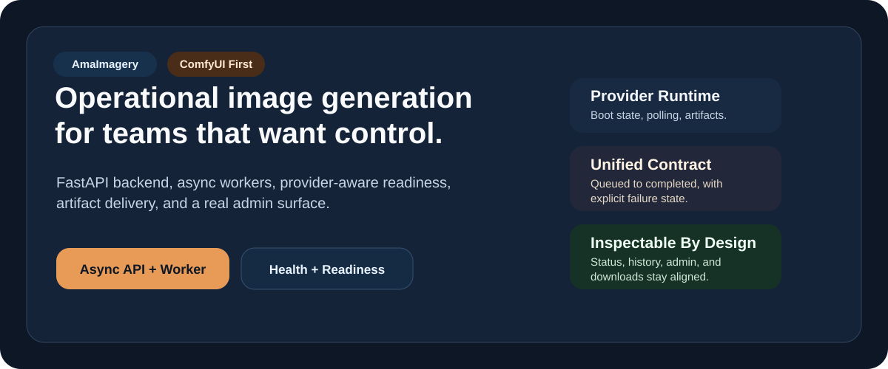
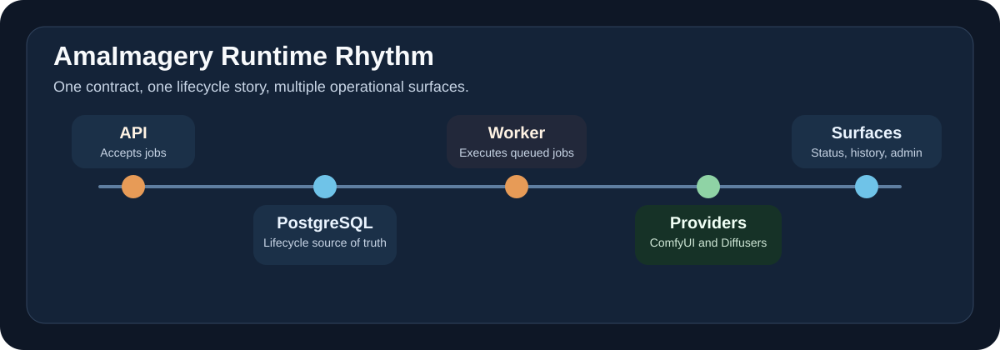

<p align="center">
  
</p>

<div align="center">

# AmaImagery

### Self-hosted image generation infrastructure with a real backend, a real worker lifecycle, and an operationally visible runtime.

[](./pyproject.toml)
[](https://www.python.org/)
[](https://fastapi.tiangolo.com/)
[](https://react.dev/)
[](https://github.com/astral-sh/ruff)
[](https://mypy.readthedocs.io/)

<strong>
  <a href="./docs/README.md">Docs</a> ·
  <a href="./docs/en/backend/README.md">Backend Notes</a> ·
  <a href="./COMMERCIAL_LICENSE.md">Commercial Licensing</a>
</strong>

</div>

AmaImagery is a self-hosted image generation platform built around a FastAPI backend, a React frontend, and an asynchronous worker pipeline. It exposes one operational contract across multiple generation providers, with `ComfyUI` as the practical primary runtime and `Diffusers` still available where local model management makes sense.

---

## ✦ A Sharper Shape

<table>
  <tr>
    <td width="33%">
      <strong>🧭 One contract</strong><br/>
      Jobs, status, history, artifacts, and terminal states stay aligned.
    </td>
    <td width="33%">
      <strong>🩺 One runtime story</strong><br/>
      Health, readiness, queue behavior, and provider state are visible.
    </td>
    <td width="33%">
      <strong>🛡️ One honest posture</strong><br/>
      Built for control and inspectability, not for pretending complexity does not exist.
    </td>
  </tr>
</table>

> AmaImagery is meant to be legible in motion. If a provider fails, the system should say so clearly. If a generation completes, every public surface should reflect the same final state.

---

## ⚙️ What Lives Here

| Surface | Purpose |
| --- | --- |
| Async generation API | Accepts jobs, persists state, exposes status and history |
| Provider runtime | Boots providers, classifies failures, reports readiness clearly |
| Worker lifecycle | Executes jobs, updates terminal state, stores artifacts |
| Admin surface | Gives superusers a live operational view of users and generations |
| CI quality gates | Enforces linting, typing, and backend verification |

---

## 🎯 Current Posture

AmaImagery is credible, usable, and actively maintained. It is also explicit about its current shape.

- `ComfyUI` is the strongest end-to-end path today
- the Docker image is still CUDA-oriented and heavy
- `Diffusers` support remains available, but large local model handling is still an operational cost
- the repository is closer to a serious self-hosted platform than to a shrink-wrapped appliance

That tradeoff is deliberate. The project optimizes for correctness, visibility, and control before pretending to be effortless.

---

## 🌘 Runtime Rhythm

<p align="center">
  
</p>

The runtime path is intentionally coherent:

1. The API accepts a generation request.
2. PostgreSQL becomes the source of truth for lifecycle state.
3. The worker submits to a provider and watches execution.
4. The provider result becomes either an artifact or an explicit failure.
5. Status, history, admin, and download endpoints reflect the same final state.

---

## 🚀 Start Here

<details open>
  <summary><strong>🧱 Run the stack</strong></summary>
  <br/>

  ```bash
  git clone https://github.com/AmaLS367/AmaImagery
  cd AmaImagery
  docker compose --env-file docker/.env.docker -f docker/compose.local.yml up -d --build
  ```

  Provider verification presets:

  - `docker/.env.verify.comfyui.example`
  - `docker/.env.verify.diffusers.example`
</details>

<details>
  <summary><strong>🛠️ Develop locally</strong></summary>
  <br/>

  ```bash
  python -m venv .venv
  .venv\Scripts\activate
  pip install -e ".[dev]"
  # add ML runtime only when you need local diffusers execution
  pip install -e ".[ml]"
  alembic upgrade head
  python run.py
  python -m app.entrypoints.generation_worker
  ```
</details>

<details>
  <summary><strong>✅ Check confidence fast</strong></summary>
  <br/>

  ```bash
  python -m ruff check app tests
  python -m mypy app
  python -m pytest tests -q
  ```

  Operational endpoints:

  - `GET /api/v1/health`
  - `GET /api/v1/healthz`
  - `GET /admin/`
</details>

---

## ✨ Why The Repository Feels Different

- provider boot state is visible rather than buried in logs
- readiness distinguishes "alive" from "able to generate"
- terminal states stay coherent across status, history, admin, and download flows
- authentication and superuser-only admin access are treated as first-class surfaces
- artifact delivery is part of the contract, not a side effect

---

## 📚 Continue Reading

<table>
  <tr>
    <td width="50%">
      <strong>🗂️ Core documentation</strong><br/><br/>
      <a href="./docs/README.md">Documentation Index</a><br/>
      <a href="./docs/en/README.md">English Documentation</a><br/>
      <a href="./docs/en/backend/admin-and-readiness.md">Backend Admin and Readiness</a><br/>
      <a href="./docs/en/deployment/provider-rollout.md">Provider Rollout Notes</a>
    </td>
    <td width="50%">
      <strong>📜 Project policies</strong><br/><br/>
      <a href="./CONTRIBUTING.md">Contributing</a><br/>
      <a href="./SECURITY.md">Security</a><br/>
      <a href="./SUPPORT.md">Support</a><br/>
      <a href="./COMMERCIAL_LICENSE.md">Commercial Licensing</a>
    </td>
  </tr>
</table>

---

## ⚖️ Open Source And Commercial

AmaImagery application code is dual-licensed:

- open-source use under `AGPL-3.0-only`
- commercial licensing by direct agreement via `amalsdev367@gmail.com`

Third-party models, datasets, and assets may carry separate obligations. Review:

- [LICENSE](./LICENSE)
- [NOTICE.txt](./NOTICE.txt)
- [ATTRIBUTIONS.md](./ATTRIBUTIONS.md)
- [Legal Docs](./docs/en/legal/README.md)

---

## 📬 Contact

| Need | Path |
| --- | --- |
| Bugs and defects | GitHub Issues |
| Product or usage discussion | GitHub Discussions |
| Security disclosure | `amalsdev367@gmail.com` |
| Commercial licensing | `amalsdev367@gmail.com` |

AmaImagery should feel sharp, calm, and inspectable before the code ever runs. The docs are part of that contract.
